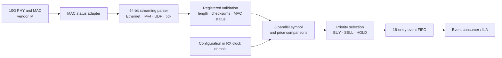

# Tick to Trade — 10G UDP Market Data Parser

Synthesizable SystemVerilog that receives Ethernet frames from a 64-bit MAC stream, validates a fixed IPv4/UDP feed, compares eight stock symbols in parallel, and emits BUY/SELL events through a buffered interface.

**Status: simulation verified; Basys 3 bitstream built and routed timing passed at 100 MHz.** See the [FPGA build results](reports/fpga-validation.md) for measured timing and resources. An initial board video shows LEDs and the display responding; the [controlled hardware acceptance test](docs/board-bringup.md) remains pending. This is a mock market-data signal processor; it does not place orders or implement an exchange order book.

The full configurable core's current 156.25 MHz out-of-context build **does not meet timing** on this Artix-7 part. That target remains an engineering milestone; the Basys 3 demonstration is a separate 100 MHz implementation.

**Using the college Basys 3:** start with the [board demo guide](boards/basys3/README.md). It generates packets internally, lets you select cases with switches, and displays BUY/SELL/HOLD/rejection on LEDs. The board has no onboard Ethernet interface.

**Board demonstration:** [Watch the Basys 3 video](media/basys3-board-demo.mp4) (approximately 40 seconds, recorded September 16, 2026). The original recording shows LEDs and the display responding during initial hardware bring-up. It uses internally generated packets; the clip does not establish physical 10G throughput or completion of all eight acceptance cases. See the [observations and next tests](docs/board-bringup.md).



## Run the demo

On the computer where this project was created, the simulator has been prepared locally. Open PowerShell in this folder and run:

```powershell
powershell -NoProfile -ExecutionPolicy Bypass -File .\scripts\run-local.ps1 -Mode Demo
```

Expected output includes:

```text
PASS cycles=105 transfers=2 table=8 fifo=16
cycle  26: BUY AAPL price=99.0000 quantity=100 sequence=1
cycle  50: SELL AAPL price=111.0000 quantity=100 sequence=3
```

The six input packets demonstrate BUY, HOLD, SELL, unknown symbol, wrong UDP port, and bad UDP checksum. Generated files are in `build/demo/`: a packet capture for Wireshark, a VCD waveform, a transfer log, and a machine-readable result.

Run all tests on this computer:

```powershell
powershell -NoProfile -ExecutionPolicy Bypass -File .\scripts\run-local.ps1 -Mode Test
```

For another machine, install Python 3.10+ and Icarus Verilog with `iverilog` and `vvp` on PATH. No Python packages are required for simulation:

```text
python tests/run.py --demo --waves
python tools/check.py
```

On Linux, `make test` and `make demo` are equivalent. Optional independent lint uses `python -m pip install pyslang==11.0.0` followed by `python tools/lint.py`. Generic synthesis uses `make synth` with Yosys. See the [tool sources](docs/sources.md) for installation references.

For the same synthesis version used by the saved local results and GitHub Actions, run:

```text
python -m pip install yowasp-yosys==0.69.0.0.post1233
yowasp-yosys -l build/synthesis.log scripts/synth.ys
```

Run the tests first to create `build/`. Older distribution packages, including Yosys 0.33, cannot parse the SystemVerilog integer casts used in this design. The GitHub workflow pins the verified synthesis tool version.

## What is implemented

| Capability | Implementation |
|---|---|
| MAC interface | 64-bit data, 8 byte enables, valid, last, normalized bad-frame flag; always ready |
| Packet profile | Untagged Ethernet, IPv4 with 20-byte header, UDP destination port 1234 by default |
| Integrity | IPv4 checksum, present UDP checksum including pseudoheader, lengths, fragment checks, MAC errors |
| Tick | One documented 24-byte message; 8-byte symbol, integer price, quantity, sequence |
| Symbol table | 8 entries by default; all symbol and threshold comparisons in parallel |
| Actions | BUY at/below buy threshold; SELL at/above sell threshold; HOLD in between |
| Output | 16-event FIFO by default; stable during stalls; drop newest on overflow |
| Diagnostics | Received/accepted/rejected frames, symbol misses, holds, enqueues and drops |
| Reproducibility | Independent Python packet model, per-cycle scoreboard, stress tests, CI workflow |

Only the normalized `tick_to_trade` core is included in the reported synthesis totals. `mac_rx_adapter` is a separately tested wiring adapter. MAC/PHY IP, board pins, and clock-domain bridges depend on the selected board.

## Verified behavior and performance boundary

The [validation report](reports/validation.md) contains the executed test matrix and source hashes. It includes 1,024 consecutive frames per run, malformed packets, every final byte-enable mask, checksum corruption, reset at each pipeline boundary, configuration collisions, and output overflow. The FIFO is also tested independently with consecutive-cycle traffic.

For a valid 66-byte frame arriving without gaps, with a matching actionable symbol and an empty output FIFO:

| Measurement | RTL cycles | At the **target** 6.4 ns clock |
|---|---:|---:|
| Last input beat sampled → output valid | 4 | 25.6 ns |
| First input beat sampled → output valid | 12 | 76.8 ns |
| First input beat sampled → earliest output handshake | 13 | 83.2 ns |

These are simulated core latencies. They exclude PHY/MAC latency, wire serialization before the first sampled beat, clock crossings, and downstream waiting. The 64-bit × 156.25 MHz interface has 10 Gb/s full-beat capacity by construction. A routed Xilinx timing report and a physical packet test are required before describing this as measured 10G hardware performance.

## Repository map

| Path | Purpose |
|---|---|
| `rtl/` | Parser, matcher, FIFO, top module, MAC status adapter |
| `tests/` | Packet-level scoreboard and standalone RTL tests |
| `tools/packets.py` | Packet builder, independent parser, PCAP writer |
| `scripts/` | Windows launcher, Yosys synthesis, Xilinx OOC flow |
| `constraints/` | Example 6.4 ns core constraints |
| `boards/basys3/` | Board top, packet ROM, pins, tests, programming guide and available prebuilt bitstream |
| `examples/` | Small demo capture, signal log, and waveform |
| `reports/` | Saved verification evidence |
| `docs/architecture.md` | Pipeline, interfaces, byte layout and design decisions |
| `docs/xilinx-bringup.md` | Steps from this core to the borrowed board |
| `docs/learn-and-present.md` | How to learn the design and present it in interviews |

## Next hardware milestone

The college board is confirmed as Basys 3 (`xc7a35tcpg236-1`). Program the [Basys 3 demo](boards/basys3/README.md) and verify its eight packet cases. A physical 10G network link needs a suitable MAC/PHY platform; the Basys 3 demo uses internal packets. The general [Xilinx bring-up guide](docs/xilinx-bringup.md) describes the later network integration.
